**Shopping-js**

간단한 SPA 스타일 쇼핑 UI 데모 프로젝트입니다. 로그인/회원가입부터 상품 목록, 필터, 장바구니, 상품 상세보기까지 기본적인 전자상거래 UI 흐름을 구현해둔 학습용 예제입니다.

**배포**
[jsshopp.netlify.app](https://jsshopp.netlify.app/)

**핵심 기능**

- **로그인/회원가입**: 기본 입력 UI 및 유효성/상태 표시를 포함.
- **상품 목록**: `data/products.json` 기반으로 상품 그리드 렌더링.
- **카테고리 필터**: 사이드바에서 카테고리 선택으로 목록 필터링.
- **가격대 필터**: 체크박스로 가격 범위 필터링.
- **검색**: 상단 검색 입력으로 상품 이름/설명 검색.
- **상품 상세보기**: 목록에서 선택한 상품의 상세 정보 표시 및 장바구니 추가.
- **장바구니**: 담긴 상품 목록 및 합계, 주문 버튼(더미 동작).
- **애니메이션/UX 개선**: GSAP을 사용한 간단한 열기/닫기 애니메이션 및 인터랙션.

**프로젝트 구조(주요 파일)**

- `index.html` : 앱 진입점
- `css/` : 스타일 시트(`main.css`, `common.css`, `customScrollbar.css`)
- `js/main.js` : 전역 초기화 및 유틸
- `js/shop/shopping.js` : 쇼핑 관련 로직(상품 렌더링, 필터, 사이드바 토글 등)
- `js/info/infoFind.js` : 아이디/비밀번호 찾기 관련 로직
- `data/products.json` : 샘플 상품 데이터

---

### 1) 로그인

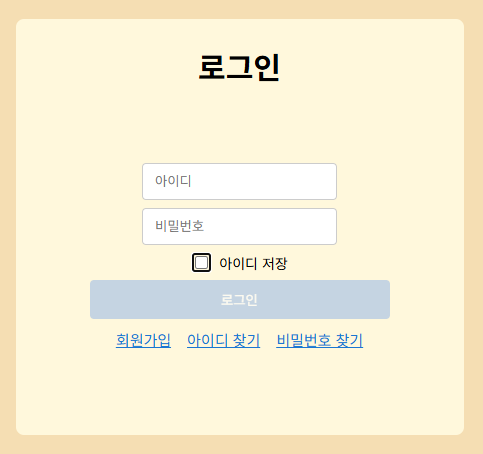

설명: 로그인 화면

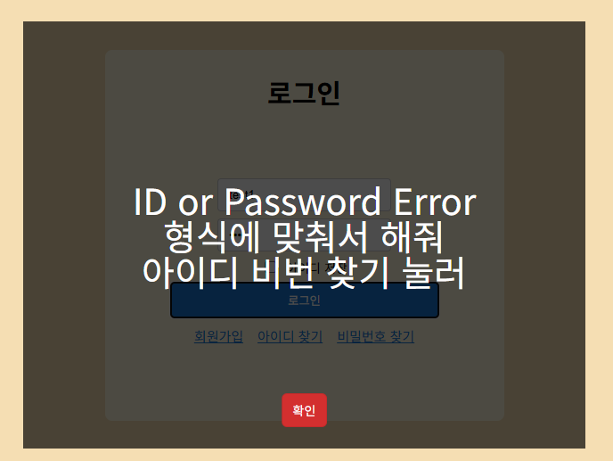

설명: 로그인 실패 시 표시되는 오류 팝업

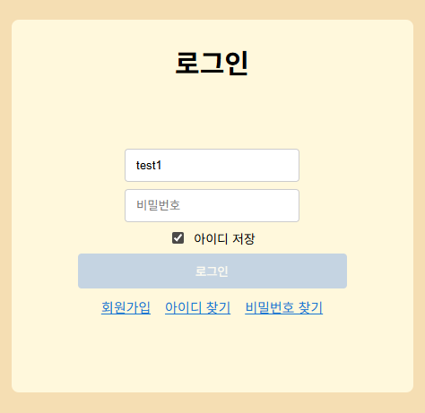

설명: '아이디 저장' 체크 후 로그아웃하면 아이디가 유지되는 예시

### 2) 회원가입

- `image/screenshots/회원가입/sc1.png` — 회원가입: 입력폼

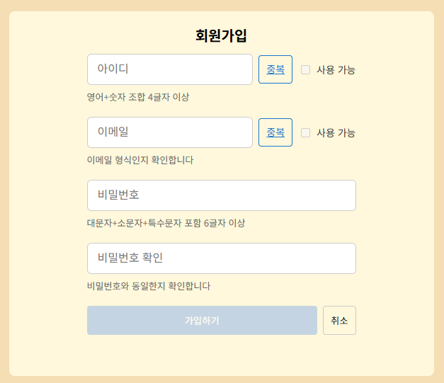

설명: 회원가입 입력 폼 예시입니다. 각 `input`에 요구되는 형식(아이디: 영어+숫자 등, 이메일: 이메일 형식, 비밀번호: 조건)을 맞춰 입력합니다.

- `image/screenshots/회원가입/sc12.png` — 형식 오류 표시

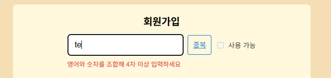

설명: 입력값이 요구 형식에 맞지 않을 경우 표시되는 오류 메시지 예시입니다.

- `image/screenshots/회원가입/sc3.png` — 아이디/이메일 중복 체크 후 상태

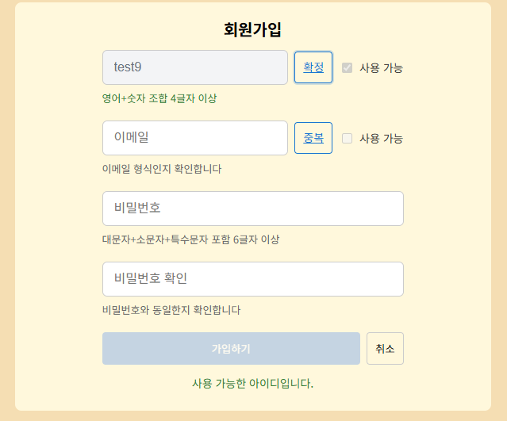

설명: 아이디와 이메일을 형식에 맞게 입력한 뒤 '중복 확인'을 누르면 사용 가능 여부가 표시됩니다. 사용 가능하면 확정 버튼이 활성화되고, 이미 사용 중이라면 '이미 사용중' 메시지가 뜹니다.

- `image/screenshots/회원가입/sc4.png` — 가입 완료 및 로컬스토리지 저장 예시

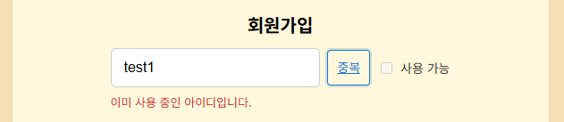

설명: '가입하기' 버튼을 누르면 입력한 회원 정보가 로컬스토리지에 저장되는 예시 화면입니다.

### 3) 아이디 찾기

- `image/screenshots/아이디/s1.png` — 등록된 이메일 입력 화면

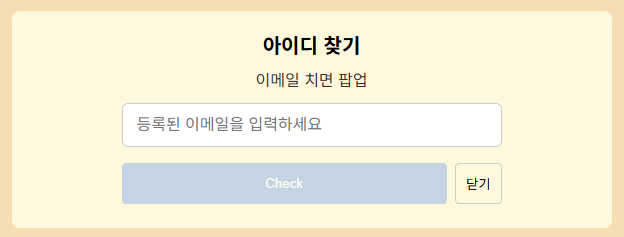

설명: 사용자가 등록된 이메일을 입력하는 화면입니다. 이메일을 입력하고 '확인' 또는 '전송' 버튼을 누르면 아이디 조회 프로세스가 시작됩니다.

- `image/screenshots/아이디/s2.png` — 팝업에 아이디 노출

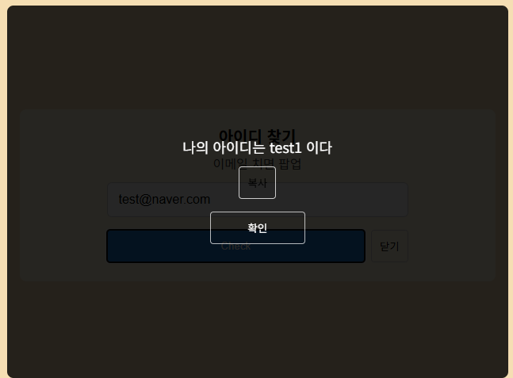

설명: 조회가 성공하면 팝업에 사용자의 아이디가 표시됩니다. 팝업에는 복사 버튼 또는 닫기 버튼이 포함됩니다.

### 4) 비밀번호 찾기

- `image/screenshots/비밀번호/sc1.png` — 아이디와 이메일 입력 화면

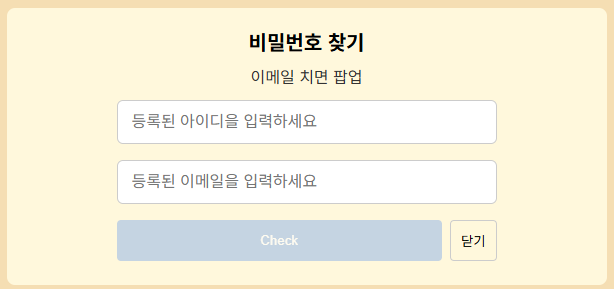

설명: 사용자가 아이디와 등록된 이메일을 입력하면 비밀번호 찾기 프로세스가 시작됩니다.

- `image/screenshots/비밀번호/sc2.png` — 팝업에 비밀번호 노출(테스트용)

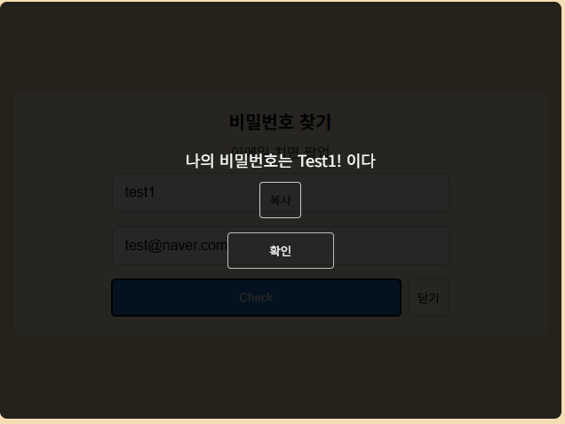

설명: 조회가 성공하면 팝업에 (테스트용) 비밀번호가 표시됩니다. 실제 서비스에서는 보안상 비밀번호를 직접 노출하지 않습니다.

- `image/screenshots/비밀번호/sc3.png` — 인증번호 이메일 전송 시도(미구현)

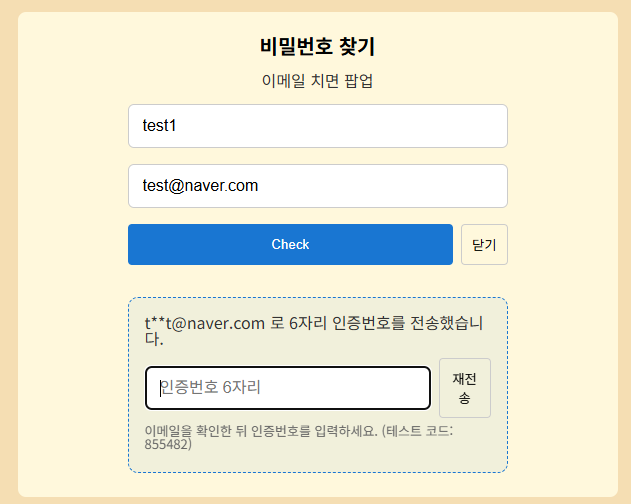

설명: 등록된 이메일로 인증번호를 보내도록 시도했으나 현재는 구현 중입니다(학습 중).

- `image/screenshots/비밀번호/sc4.png` — 테스트 코드 입력 후 비밀번호 변경 화면

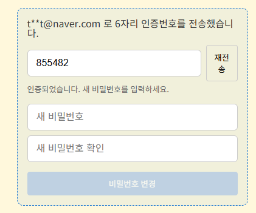

설명: 테스트 인증 코드를 입력하면 비밀번호 변경 화면으로 이동합니다.

- `image/screenshots/비밀번호/sc5.png` — 현재 비밀번호 입력(확인용)

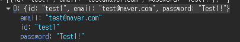

설명: 보안 확인을 위해 현재 비밀번호를 입력하는 단계(테스트 또는 확인용).

- `image/screenshots/비밀번호/sc6.png` — 변경할 새 비밀번호 입력 및 확인

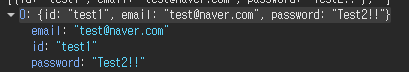

설명: 새 비밀번호와 확인 입력란에 동일한 값을 입력합니다.

- `image/screenshots/비밀번호/sc7.png` — 변경 완료 팝업

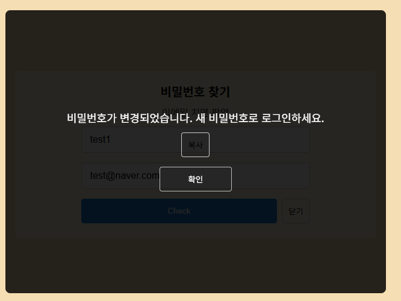

설명: 비밀번호 변경이 완료되면 성공 팝업이 표시됩니다.

### 5) 상품 화면

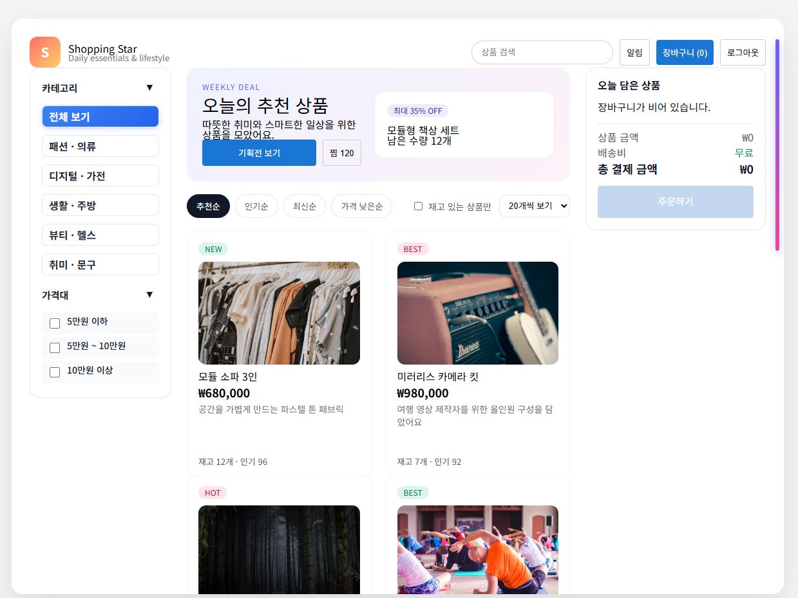

**사용 라이브러리**

- `GSAP`: 사이드바 토글, 탭 전환, 카드 인터랙션 등 UI 애니메이션을 담당합니다.
- `OverlayScrollbars`: 쇼핑 페이지 전체에 커스텀 스크롤 경험을 제공합니다.

**주요 기능 요약**

1. **사이드바 화살표 토글**: 카테고리·가격 섹션을 GSAP 애니메이션으로 부드럽게 열고 닫습니다.
2. **카테고리 필터**: "전체 보기", "패션", "디지털" 등 원하는 카테고리를 선택하면 해당 상품만 즉시 필터링됩니다.
3. **가격대 필터**: 금액 범위 체크박스로 다중 선택이 가능하며, 선택 값이 실시간으로 목록에 반영됩니다.
4. **상품 상세 페이지**: 각 카드 클릭 시 상세 영역으로 전환되어 이미지, 설명, 재고, 인기도 정보를 확인하고 장바구니에 담을 수 있습니다.
5. **장바구니 저장(로컬스토리지)**: 로그인한 아이디마다 장바구니를 `localStorage`에 분리 저장합니다. 로그아웃 후 다시 로그인해도 기존 담은 상품과 금액 합계를 그대로 복원합니다.

---

## 코드 리뷰/구현 설명

### 인증 & 세션 (`js/main.js`)

- 로그인 버튼 이벤트에서 입력값을 `localStorage.users`와 비교해 인증 후 `shoppingActiveUserId`에 저장합니다.

```javascript
// js/main.js
loginBtn.addEventListener("click", function () {
  if (loginBtn.hasAttribute("disabled")) return;

  const id = idInput.value.trim();
  const pw = pwInput.value || "";
  const foundUser = findUserById(id);
  const authOk = foundUser && foundUser.password === pw;
  if (!authOk) {
    showErrorPop(3500);
    return;
  }

  persistSession(foundUser.id);
  currentUser = foundUser;
  notifyUserChange(foundUser.id);
  showShoppingView();
  showSuccessPop();
});
```

- `shopping:user-changed` 커스텀 이벤트를 발행하여 쇼핑 모듈이 로그인 상태를 감지하도록 했습니다.

```javascript
// js/main.js
function notifyUserChange(userId) {
  document.dispatchEvent(
    new CustomEvent("shopping:user-changed", {
      detail: { userId: userId || null },
    })
  );
}
```

- 로그아웃 시 세션 키를 제거하고 로그인 폼을 초기화합니다.

```javascript
// js/main.js
function handleLogout() {
  clearSession();
  currentUser = null;
  notifyUserChange(null);
  if (pwInput) pwInput.value = "";
  if (loginPage) loginPage.classList.remove("d-none");
  if (shoppingPage) shoppingPage.classList.add("d-none");
  updateButtonState();
}
```

### 회원가입 (`js/signup/signup.js`)

- 아이디·이메일 중복 체크 버튼이 필드를 잠그고 `확정` 상태를 표시하며, 정규식 기반 유효성 검사를 수행합니다.

```javascript
// js/signup/signup.js
idCheckBtn.addEventListener("click", function () {
  if (isFieldLocked(idInput)) {
    releaseFieldLock(idInput, idOkCheckbox, idCheckBtn);
    return;
  }

  const id = idInput.value.trim();
  if (!validateId(id)) {
    updateHint(idHint, false, "영어+숫자 조합 4글자 이상", "영어와 숫자를 조합해 4자 이상 입력하세요");
    return;
  }

  const raw = localStorage.getItem("users");
  const users = raw ? JSON.parse(raw) : [];
  const exists = users.some((u) => (u.id || "") === id);

  if (exists) {
    updateHint(idHint, false, "영어+숫자 조합 4글자 이상", "이미 사용 중인 아이디입니다.");
  } else {
    lockFieldAfterCheck(idInput, idOkCheckbox, idCheckBtn);
  }
});
```

- 모든 입력이 통과하면 `localStorage.users`에 `{ id, email, password }`를 저장하고 로그인 폼 아이디를 자동 채워줍니다.

```javascript
// js/signup/signup.js
submitBtn.addEventListener("click", function () {
  // 모든 입력값 유효성 검사를 통과한 뒤
  const res = saveUser({ id: id.trim(), email: email.trim(), password: pw });
  if (!res || !res.ok) return;

  msg.style.color = "#2e7d32";
  msg.textContent = "회원가입이 완료되었습니다.";

  const loginIdInput = document.querySelector(".login-id");
  if (loginIdInput) loginIdInput.value = id.trim();
  closeSignup();
});
```

### 아이디/비밀번호 찾기 (`js/info/infoFind.js`)

- 등록된 이메일/아이디를 검색하여 GSAP 애니메이션 팝업으로 결과를 보여줍니다.

```javascript
// js/info/infoFind.js
if (infoIdSubmit) {
  infoIdSubmit.addEventListener("click", () => {
    const email = infoIdEmailInput.value.trim();
    if (!validateEmail(email)) {
      infoResultIdManager.show("유효한 이메일을 입력하세요.");
      return;
    }
    const raw = localStorage.getItem("users");
    const users = raw ? JSON.parse(raw) : [];
    const found = users.find((u) => (u.email || "").toLowerCase() === email.toLowerCase());
    if (found) {
      infoResultIdManager.show("나의 아이디는 " + (found.id || "(없음)") + " 이다", found.id || "");
    } else {
      infoResultIdManager.show("등록된 이메일이 없습니다.");
    }
  });
}
```

- 비밀번호 찾기에는 인증 코드(테스트용)를 생성해 재설정 패널을 노출하고, 새 비밀번호를 로컬스토리지에 저장하는 흐름이 포함됩니다.

```javascript
// js/info/infoFind.js
function startPasswordReset(meta) {
  const code = generateVerificationCode();
  pendingPwReset = {
    email: meta.email,
    id: meta.id,
    code,
    expiresAt: Date.now() + 5 * 60 * 1000,
  };
  showResetPanel(meta.email, code);
}

function handleResetSubmit() {
  if (!resetCodeVerified || !pendingPwReset) return;
  const raw = localStorage.getItem("users");
  const users = raw ? JSON.parse(raw) : [];
  const idx = users.findIndex(
    (u) =>
      (u.id || "").toLowerCase() === pendingPwReset.id.toLowerCase() &&
      (u.email || "").toLowerCase() === pendingPwReset.email.toLowerCase()
  );
  if (idx === -1) return;
  users[idx].password = infoResetPasswordInput.value;
  localStorage.setItem("users", JSON.stringify(users));
  infoResultPwManager.show("비밀번호가 변경되었습니다. 새 비밀번호로 로그인하세요.");
  clearResetWorkflow();
}
```

### 쇼핑 기능 (`js/shop/shopping.js`)

- `OverlayScrollbars`로 쇼핑 셸에 커스텀 스크롤을 적용하고, `shopping:page-shown` 이벤트 이후 초기화합니다.

```javascript
// js/shop/shopping.js
document.addEventListener("shopping:page-shown", () => {
  initScroll();
  initShoppingModule().catch((error) => console.error("[쇼핑 모듈] 초기화 실패", error));
});

function initScroll() {
  if (scrollInstance) return;
  refs.page = document.querySelector(".shopping-page");
  refs.shell = document.querySelector(".shopping-shell");
  if (!refs.page || !refs.shell || refs.page.classList.contains("d-none")) return;
  scrollInstance = OverlayScrollbars(refs.shell, SCROLL_OPTIONS);
}
```

- 카테고리/가격/정렬/재고 필터는 `state.filters`에 입력되며, `applyFiltersAndRender()`에서 상품 리스트를 필터링·정렬 후 그리드에 렌더링합니다.

```javascript
// js/shop/shopping.js
function applyFiltersAndRender() {
  if (!state.products.length) {
    setGridMessage("상품 정보를 준비 중입니다...");
    return;
  }
  const filtered = filterProducts(state.products);
  state.filteredProducts = sortProducts(filtered);
  renderProducts();
}

function filterProducts(list) {
  const { search, category, priceRanges, stockOnly } = state.filters;
  let result = list.slice();
  if (category !== "all") result = result.filter((item) => item.category === category);
  if (priceRanges.length) result = result.filter((item) => priceRanges.some((range) => matchesPriceRange(item.price, range)));
  if (stockOnly) result = result.filter((item) => item.stock > 0);
  if (search) {
    const keyword = search.toLowerCase();
    result = result.filter((item) => `${item.name} ${item.description} ${item.category}`.toLowerCase().includes(keyword));
  }
  return result;
}
```

- 상품 카드를 클릭하면 상세 영역으로 전환되고, 장바구니 추가 버튼은 재고 여부에 따라 비활성화됩니다.

```javascript
// js/shop/shopping.js
function handleProductSelect(product) {
  state.selectedProductId = product.id;
  showProductDetail(product);
}

function showProductDetail(product) {
  refs.productGrid.classList.add("d-none");
  refs.detailSection.classList.remove("d-none");
  refs.detailImage.src = product.image || DEFAULT_PRODUCT_IMAGE;
  refs.detailName.textContent = product.name;
  refs.detailPrice.textContent = formatPrice(product.price);
  updateDetailActionState(product);
}

function updateDetailActionState(product) {
  const isSoldOut = product.stock <= 0;
  refs.detailAdd.disabled = isSoldOut;
  refs.detailAdd.textContent = isSoldOut ? "품절" : "장바구니 추가";
}
```

- `shopping:user-changed` 이벤트를 수신해 사용자별 장바구니를 `shoppingCart:<userId>` 키로 저장/복원하여 로그아웃 후에도 품목이 유지됩니다.

```javascript
// js/shop/shopping.js
document.addEventListener("shopping:user-changed", handleUserChange);

function handleUserChange(event) {
  const nextUserId = event?.detail?.userId ? String(event.detail.userId) : null;
  if (currentUserId === nextUserId) return;
  currentUserId = nextUserId;
  if (!currentUserId) {
    state.cart = [];
    renderCart();
    return;
  }
  loadCartForUser(currentUserId);
}

function persistCart() {
  if (!currentUserId) return;
  const payload = state.cart.map((item) => ({ productId: item.productId, qty: item.qty }));
  localStorage.setItem(`shoppingCart:${currentUserId}`, JSON.stringify(payload));
}
```

---
